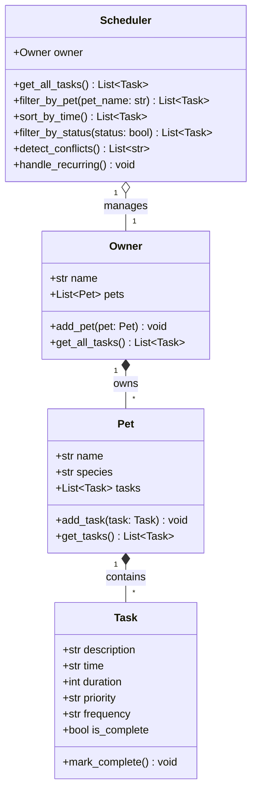

# Final PawPal+ UML Diagram

```mermaid
classDiagram
    class Task {
        +str description
        +str time
        +int duration
        +str priority
        +str frequency
        +bool is_complete
        +mark_complete() void
    }
    
    class Pet {
        +str name
        +str species
        +List~Task~ tasks
        +add_task(task: Task) void
        +get_tasks() List~Task~
    }
    
    class Owner {
        +str name
        +List~Pet~ pets
        +add_pet(pet: Pet) void
        +get_all_tasks() List~Task~
    }
    
    class Scheduler {
        +Owner owner
        +get_all_tasks() List~Task~
        +filter_by_pet(pet_name: str) List~Task~
        +sort_by_time() List~Task~
        +filter_by_status(status: bool) List~Task~
        +detect_conflicts() List~str~
        +handle_recurring() void
    }
    
    Pet "1" *-- "*" Task : contains
    Owner "1" *-- "*" Pet : owns
    Scheduler "1" o-- "1" Owner : manages
```